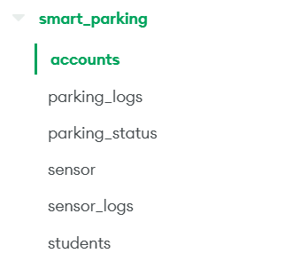

# Python Web Server

This is a python web server for Smart Parking System using Python and MongoDB.

## How to run

### 1. Clone this project

```bash
git clone https://github.com/trungtranquoc/Multidisciplinary-Project---Smart-Parking-System-.git

cd server
```

### 2. Using Docker

If you want to use Docker container to run, please build the image and run the container by the following commands

```bash
docker build -t smart-parking-system-server .

docker run -p 8000:8000 smart-parking-system-server
```

### 3. No Docker

#### Step 1: Install requirements

```bash
pip install -r requirements.txt
```

#### Step 2: Setup MongoDB collection

- Create `smart_parking` database with the corresponding collections.
- When creating `sensor_logs` collection, choose **Time Series Collection** with
    - **`timeField` :** `timestamp`
    - **`metaField` :** `metadata`
    - **`expireAfterSeconds` :** `86400`



#### Step 3: Create .env file
In the `/server` folder, create `.env` file with the attributes:

- `MONGOURI`: the path to MongoDB Cluster Endpoint
- `SECRET_KEY`: a secret key created manually by any kind of hashing algorithm, just for security
- `ALGORITHM`: an algorithm for JWT encoding (you can use *HS256* by default)

#### Step 4: Run

```bash
uvicorn main:app
```

|Option|Example|
|---|---|
|`--host`|`0.0.0.0`|
|`--port`|`8000`|
